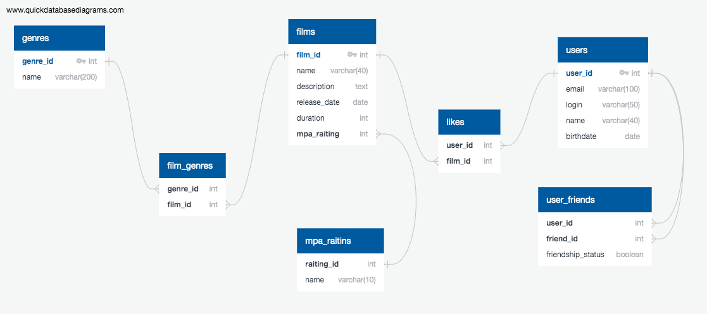

# java-filmorate
Проекта курса Java-разработчик "Яндекс.Практикума".

## Схема базы данных

### Примеры запросов:

#### Film
* получить все фильмы: `SELECT * FROM Film`
* получить фильм по id: `SELECT * FROM Film WHERE film_id=1`
* получить популярные фильмы: 
`SELECT * FROM Film f JOIN Likes l ON l.film_id=f.film_id WHERE (SELECT COUNT(film_id) FROM Likes) > 10 `

#### User 
* получить всех пользователей:
  `SELECT * FROM User`
* получить пользователя по id: `SELECT * FROM User WHERE user_id=1`